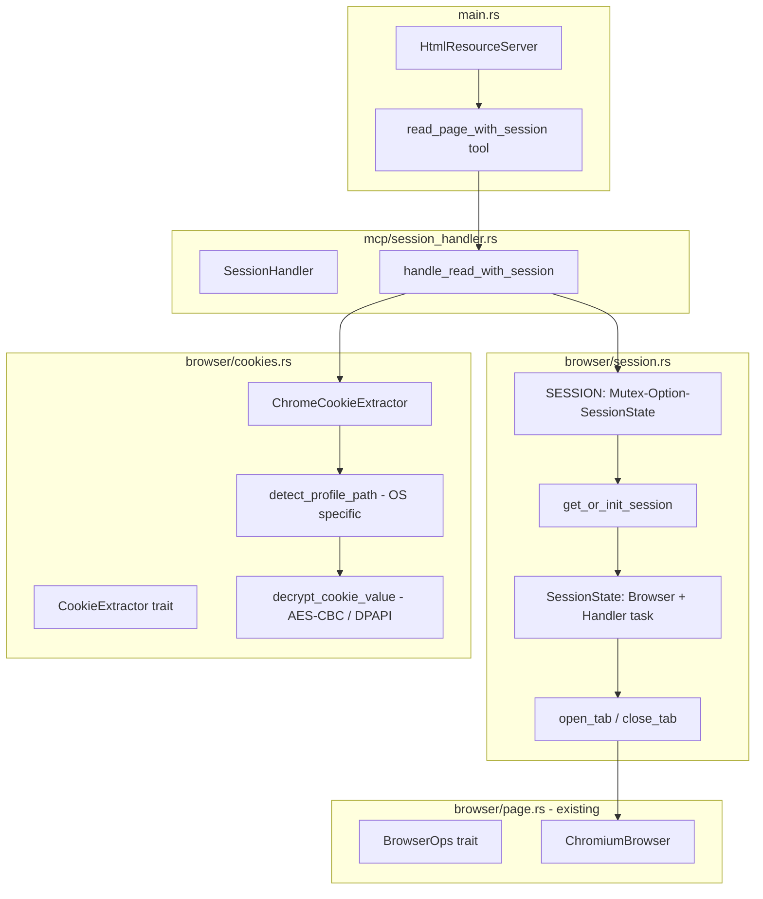

# Technical Specification: chrome-session-navigation

**Feature**: chrome-session-navigation
**Feature ID**: feat-001
**Status**: Draft (reopened — act_with_session moved to feat-002)
**Functional Spec**: approved 2026-06-12
**Created**: 2026-06-12

---

## 1. Executive Summary

Add one new MCP tool — `read_page_with_session` — backed by a persistent
`chromiumoxide` browser session that lives for the lifetime of the MCP server process.
Authentication is bootstrapped by extracting and decrypting cookies from the user's
Google Chrome on-disk profile and injecting them via CDP before each navigation. Cookies
set by websites during navigation (server `Set-Cookie` responses) persist in the
browser's in-memory cookie store, so a login performed via feat-002's `act_with_session`
carries over to subsequent `read_page_with_session` calls with no re-authentication.

The session infrastructure (`SESSION` global, `get_or_init_session`, `SessionState`) is
shared with feat-002 — both features use the same singleton browser process.

---

## 2. Architecture



**Flow — first call:**

1. `get_or_init_session()` locks `SESSION` mutex → finds `None` → spawns `Browser::launch()` → stores
   `Some(SessionState)` → unlocks
2. `ChromeCookieExtractor::extract(url)` reads Chrome Cookies SQLite DB → decrypts values → returns `Vec<Cookie>`
3. Open new tab on session browser → inject cookies via `Network.setCookies` → navigate → wait → read HTML → close tab

**Flow — Nth call (same Claude Code session):**

1. `get_or_init_session()` locks → finds `Some(SessionState)` → unlocks immediately
2. Cookie extraction repeats (BR-1: always fresh)
3. New tab on same browser → inject cookies → navigate → read → close tab

**Flow — session crash recovery:**

1. `get_or_init_session()` locks → `SessionState` alive check fails → sets `None` → reinitializes → unlocks

---

## 3. Module Structure

**New files:**

| File                         | Role                                                                                            |
|------------------------------|-------------------------------------------------------------------------------------------------|
| `src/browser/session.rs`     | `SESSION` global, `SessionState`, `get_or_init_session()`, tab lifecycle. Shared with feat-002. |
| `src/browser/cookies.rs`     | `CookieExtractor` trait, `ChromeCookieExtractor`, OS path detection, decryption                 |
| `src/mcp/session_handler.rs` | `SessionHandler`, `handle_read_with_session`                                                    |

**Modified files:**

| File                 | Change                                                             |
|----------------------|--------------------------------------------------------------------|
| `src/browser/mod.rs` | Export `session` and `cookies` modules                             |
| `src/mcp/mod.rs`     | Export `session_handler` module                                    |
| `src/types/error.rs` | Add `CookieExtractionError`, `SessionUnavailable`                  |
| `src/main.rs`        | Add `SessionHandler` field; register `read_page_with_session` tool |
| `Cargo.toml`         | Add new dependencies (see §8)                                      |

---

## 4. Data Model

### 4.1 New `HtmlError` variants (`src/types/error.rs`)

```rust
CookieExtractionError(String), // Chrome profile not found, SQLite error, decrypt error
SessionUnavailable(String),     // Failed to init or reuse browser session
```

### 4.2 `src/browser/session.rs` — key types

```rust
pub(crate) struct SessionState {
    pub browser: chromiumoxide::Browser,
    pub handler: tokio::task::JoinHandle<()>,
}

static SESSION: std::sync::OnceLock<tokio::sync::Mutex<Option<SessionState>>> =
    std::sync::OnceLock::new();

/// Returns a reference to the global session mutex.
/// Initializes the OnceLock on first call.
pub(crate) fn session_lock()
    -> &'static tokio::sync::Mutex<Option<SessionState>>
{
    SESSION.get_or_init(|| tokio::sync::Mutex::new(None))
}

/// Acquires the session, initializing or recovering it as needed.
pub(crate) async fn get_or_init_session()
    -> Result<tokio::sync::MutexGuard<'static, Option<SessionState>>, HtmlError>
```

**Why `tokio::sync::Mutex` over `std::sync::Mutex`:** session initialization is async
(`Browser::launch()` is `async`). A `std::sync::Mutex` would block the tokio thread
during initialization. `tokio::sync::Mutex` correctly yields while holding the lock.

---

## 5. Session Lifecycle

```
Process start
    │
    ▼
SESSION = OnceLock::new()  (empty)

First session-aware tool call (feat-001 or feat-002)
    │
    ├─ session_lock().lock().await
    ├─ guard is None → Browser::launch() (headless Chrome, unique tmp dir)
    ├─ spawn handler task (chromiumoxide event loop)
    ├─ store Some(SessionState { browser, handler }) in guard
    └─ unlock

Per-call tab lifecycle
    │
    ├─ browser.new_page("about:blank")
    ├─ page.set_extra_http_headers(headers)
    ├─ page.set_cookies(extracted_cookies)
    ├─ page.goto(url).await
    ├─ tokio::time::sleep(wait_ms).await
    ├─ [read HTML]
    └─ page.close().await

Session crash recovery (detected when browser.new_page() fails)
    │
    ├─ set guard to None
    ├─ abort handler task
    └─ re-run initialization (same path as first call)

Process exit (Claude Code closed)
    └─ SESSION drops → Mutex<Option<SessionState>> drops
       → SessionState drops → Browser drops → child process SIGKILL
```

---

## 6. Cookie Extraction

### 6.1 `CookieExtractor` trait (`src/browser/cookies.rs`)

```rust
/// Extracts Chrome cookies relevant to `url` from the local Chrome profile.
/// Trait boundary enables mock injection in unit tests.
///
/// No `Send + Sync` supertrait bound: `extract()` is synchronous and is always
/// called and dropped before the first `.await` in the handler, so it never
/// participates in the future's state machine.
#[cfg_attr(test, mockall::automock)]
pub(crate) trait CookieExtractor {
    fn extract(&self, url: &str) -> Result<Vec<Cookie>, HtmlError>;
}
```

### 6.2 Profile path detection

```rust
pub(crate) fn default_cookies_path() -> Option<PathBuf> {
    #[cfg(target_os = "macos")]
    {
        dirs::home_dir().map(|h| h
            .join("Library/Application Support/Google/Chrome/Default/Cookies"))
    }
    #[cfg(target_os = "linux")]
    {
        dirs::home_dir().map(|h| h
            .join(".config/google-chrome/Default/Cookies"))
    }
    #[cfg(target_os = "windows")]
    {
        std::env::var("LOCALAPPDATA").ok().map(|p| PathBuf::from(p)
            .join("Google/Chrome/User Data/Default/Network/Cookies"))
    }
}
```

### 6.3 Decryption per OS

**macOS** — AES-128-CBC, key derived via PBKDF2-SHA1 from Keychain secret:

```rust
// 1. Read encryption key from Keychain
//    service = "Chrome Safe Storage", account = "Chrome"
//    Via: security-framework crate (Security::find_generic_password)
// 2. Derive 16-byte key: PBKDF2-HMAC-SHA1(password=keychain_secret,
//                          salt=b"saltysalt", iterations=1003, dklen=16)
// 3. Decrypt: AES-128-CBC, iv = b" " * 16 (16 spaces)
//    Strip 3-byte prefix ("v10" or "v11") from raw DB value before decrypt
```

**Linux** — same PBKDF2 but hardcoded password:

```rust
// password = b"peanuts", salt = b"saltysalt", iterations = 1, dklen = 16
// Strip "v10" prefix; decrypt AES-128-CBC with iv = 16 spaces
```

**Windows** — DPAPI:

```rust
// CryptUnprotectData on the raw encrypted_value bytes
// Via: windows crate feature "Win32_Security_Cryptography"
```

Cookies with `encrypted_value` empty and `value` non-empty are already plaintext —
returned as-is (secure cookies in older Chrome versions or third-party profiles).

### 6.4 SQLite query

```sql
SELECT host_key, name, encrypted_value, value, path, expires_utc, is_secure
FROM   cookies
WHERE  host_key LIKE '%' || ?1 || '%'
```

The domain extracted from `url` (`example.com`) is used as the filter parameter.

Opened with `rusqlite::OpenFlags::SQLITE_OPEN_READ_ONLY | SQLITE_OPEN_NO_MUTEX`
to avoid conflicting with Chrome's WAL mode.

---

## 7. MCP Tool Contract: `read_page_with_session`

**Input:**

```rust
struct ReadPageWithSessionParams {
    url:            String,                          // required, http(s)
    stealth:        Option<bool>,                    // default false
    include_images: Option<bool>,                    // default true
    debug_port:     Option<u16>,                     // opt-in: connect to existing Chrome
    headers:        Option<HashMap<String, String>>,
}
```

**Output:** same as `read_page` — `CallToolResult::success(vec![Content::text(...)])` ±
image content items

**Error cases:**

- `CookieExtractionError` → text error with profile path hint
- `SessionUnavailable` → text error with retry hint
- `InvalidUrl` → text error

---

## 8. `main.rs` Integration

```rust
#[derive(Clone)]
pub struct HtmlResourceServer {
    fetcher:         HtmlFetcher,
    form_handler:    FormHandler,
    session_handler: SessionHandler,   // NEW
    tool_router:     ToolRouter<Self>,
}

// One new #[tool(...)] method added to #[tool_router] impl block:
// - read_page_with_session
```

`SessionHandler` is `#[derive(Clone, Default)]` — same pattern as `FormHandler`.
It holds no state (the session lives in the global `SESSION`).

---

## 9. Design Decisions

| #  | Decision                                                                     | Rationale                                                                                                                                                                                                          |
|----|------------------------------------------------------------------------------|--------------------------------------------------------------------------------------------------------------------------------------------------------------------------------------------------------------------|
| D1 | `tokio::sync::Mutex<Option<SessionState>>` for global session                | `Option` allows transparent crash recovery without reinitializing the `OnceLock`. `tokio::Mutex` avoids blocking the async runtime during `Browser::launch()`.                                                     |
| D2 | `CookieExtractor` as an injectable trait (no `Send + Sync`)                  | Enables unit tests to mock cookie extraction without touching the filesystem or OS keychain. `extract()` is synchronous and dropped before the first `.await`, so no thread-safety bounds are needed on the trait. |
| D3 | Re-extract cookies on every call (not cached)                                | Cookies expire. Caching would serve stale cookies silently, causing mysterious 401s. The SQLite read is cheap (<5ms).                                                                                              |
| D4 | `rusqlite` with `bundled` feature                                            | Ships its own SQLite, avoiding version conflicts with the system SQLite. Ensures consistent WAL-mode read behaviour across macOS, Linux, Windows.                                                                  |
| D5 | `security-framework` crate (macOS) instead of shelling out to `security` CLI | Process spawning is slower and more error-prone than a direct library call. The crate provides a safe Rust wrapper over the macOS Security framework.                                                              |

---

## 10. Testing Strategy

### 10.1 Unit tests (pure — no Chrome, no filesystem)

**`src/browser/cookies.rs`**

- `MockCookieExtractor` verifies the extractor is called with the correct domain derived from the URL
- `decrypt_cookie_value` tests: known plaintext cookie, `v10` prefix stripping, empty `encrypted_value` returns raw
  `value`
- `default_cookies_path` returns `Some(...)` on supported OS, `None` otherwise (cfg-gated)

**`src/browser/session.rs`**

- `get_or_init_session` initializes `None` guard on first call
- Recovery path: given guard is `None` (simulated crash), reinitializes correctly

### 10.2 Integration tests (real Chrome — `#[serial_test::serial]`)

```rust
#[serial_test::serial]
#[tokio::test(flavor = "multi_thread")]
async fn test_read_page_with_session_unauthenticated_page() {
    let handler = SessionHandler::default();
    let result = handler.handle_read_with_session(
        "https://httpbin.org/get", false, true, None, None).await;
    assert!(result.is_ok());
}

#[serial_test::serial]
#[tokio::test(flavor = "multi_thread")]
async fn test_session_reused_across_calls() {
    let handler = SessionHandler::default();
    let _ = handler.handle_read_with_session(
        "https://httpbin.org/get", false, false, None, None).await;
    let _ = handler.handle_read_with_session(
        "https://httpbin.org/get", false, false, None, None).await;
    assert!(session_lock().lock().await.is_some());
}
```

Tests run with `-- --test-threads=1` to avoid Chrome concurrency failures.

---

## 11. Security

### 11.1 Cookie handling

- Cookies are decrypted in-process, never written to disk, never logged
- CDP `Network.setCookies` injects only cookies matching the target URL's domain
- After the tab is closed, cookies in that tab's context are garbage-collected by chromiumoxide

### 11.2 Keychain access (macOS)

First call triggers a macOS system permission dialog for Keychain access
(`"mcp-web-porter" wants to access "Chrome Safe Storage"`). This is expected OS behaviour.
The app does not store or cache the Keychain secret beyond the duration of the SQLite decrypt call.

---

## 12. New Cargo Dependencies

```toml
[dependencies]
# Cookie extraction
rusqlite = { version = "0.40", features = ["bundled"] }

# Crypto (RustCrypto — latest compatible set as of 2026-06-12)
# aes 0.9 / cbc 0.2 / hmac 0.13 / pbkdf2 0.13 / sha1 0.11 all align on
# cipher 0.5 + digest 0.11 — verify feature flags still compile at impl time
aes    = "0.9"
cbc    = { version = "0.2", features = ["alloc"] }
pbkdf2 = { version = "0.13", features = ["hmac"] }
hmac   = "0.13"
sha1   = "0.11"

# OS-specific home dir detection
dirs = "6"

[target.'cfg(target_os = "macos")'.dependencies]
security-framework = "3"

[target.'cfg(target_os = "windows")'.dependencies]
windows = { version = "0.62", features = [
    "Win32_Security_Cryptography",
    "Win32_Foundation",
] }
```

`futures` is already present. No other new dependencies required.

---

## 13. Performance

| Concern                         | Approach                                                                        |
|---------------------------------|---------------------------------------------------------------------------------|
| Browser cold start (first call) | ~1–3s one-time cost. All subsequent calls skip this.                            |
| Cookie SQLite read              | <5ms. Read-only WAL. No caching needed.                                         |
| Tab open/close per call         | ~200ms. Each call opens a fresh tab to prevent DOM state leakage between calls. |
