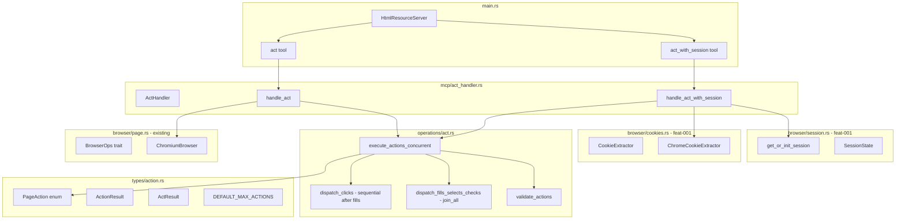

# Technical Specification: batch-page-actions

**Feature**: batch-page-actions
**Feature ID**: feat-002
**Status**: Draft
**Functional Spec**: Draft
**Created**: 2026-06-12
**Depends on**: feat-001 — `browser/session.rs`, `browser/cookies.rs`

---

## 1. Executive Summary

Add two new MCP tools — `act_with_session` and `act` — that execute multiple page
interactions concurrently in a single call. `act_with_session` uses the persistent
Chrome session from feat-001 (session infrastructure + cookie extraction);
`act` spawns a fresh browser per call (same pattern as existing stateless tools).

Both tools dispatch Fill / Select / Check actions concurrently via `futures::join_all`
over cloned `chromiumoxide::Page` Arc references, then run Click actions sequentially
after fills settle. All actions return individual results; one failure does not abort
the rest. The response always includes `page_text_after` and an optional `next_step`.

---

## 2. Architecture



**Flow — `act_with_session`:**

1. Extract cookies via `ChromeCookieExtractor::extract(url)` (feat-001)
2. `get_or_init_session()` (feat-001) → acquire/reuse persistent browser
3. Open new tab → inject cookies → navigate → wait for render
4. Detect form fields
5. `execute_actions_concurrent` → fills/selects/checks in parallel, then clicks
6. Read `page_text_after`, detect `next_step`, close tab

**Flow — `act`:**

1. Spawn fresh `ChromiumBrowser::new()` (same as existing tools)
2. Apply optional cookies/headers
3. Navigate → wait → detect fields
4. `execute_actions_concurrent` (same engine as `act_with_session`)
5. Read `page_text_after`, detect `next_step`, cleanup browser

---

## 3. Module Structure

**New files:**

| File                     | Role                                                             |
|--------------------------|------------------------------------------------------------------|
| `src/types/action.rs`    | `PageAction`, `ActionResult`, `ActResult`, `DEFAULT_MAX_ACTIONS` |
| `src/operations/act.rs`  | `validate_actions`, `execute_actions_concurrent`                 |
| `src/mcp/act_handler.rs` | `ActHandler`, `handle_act_with_session`, `handle_act`            |

**Modified files:**

| File                    | Change                                                                   |
|-------------------------|--------------------------------------------------------------------------|
| `src/types/mod.rs`      | Export `action` module; add `NoActions`, `TooManyActions` to `HtmlError` |
| `src/types/error.rs`    | Add `NoActions`, `TooManyActions { count: usize, max: usize }`           |
| `src/operations/mod.rs` | Export `act` module                                                      |
| `src/mcp/mod.rs`        | Export `act_handler` module                                              |
| `src/main.rs`           | Add `ActHandler` field; register `act_with_session` and `act` tools      |

**Reused from feat-001 (no modification):**

| File                     | Usage                                                     |
|--------------------------|-----------------------------------------------------------|
| `src/browser/session.rs` | `get_or_init_session()`, `session_lock()`, `SessionState` |
| `src/browser/cookies.rs` | `CookieExtractor` trait, `ChromeCookieExtractor`          |

---

## 4. Data Model

### 4.1 `src/types/action.rs`

```rust
#[derive(Debug, Clone, serde::Deserialize, serde::Serialize, schemars::JsonSchema)]
#[serde(tag = "type")]
pub enum PageAction {
    Fill   { identifier: String, value: FieldValue },
    Select { identifier: String, value: String },
    Click  { label: Option<String>, id: Option<String> },
    Check  { identifier: String, checked: bool },
}

#[derive(Debug, serde::Serialize)]
pub struct ActionResult {
    pub action:  PageAction,
    pub success: bool,
    pub error:   Option<String>,
}

#[derive(Debug, serde::Serialize)]
pub struct ActResult {
    pub action_results:  Vec<ActionResult>,
    pub page_text_after: String,
    pub next_step:       Option<FormStep>,
}

/// Default upper bound on actions per call.
/// AI-agent safety guard: prevents a looping agent from generating an unbounded
/// action list. Real web forms rarely exceed 15 fields; 20 provides headroom.
/// Callers may override via `ActWithSessionParams::max_actions`.
pub(crate) const DEFAULT_MAX_ACTIONS: usize = 20;
```

### 4.2 New `HtmlError` variants (`src/types/error.rs`)

```rust
NoActions,                                   // actions list is empty
TooManyActions { count: usize, max: usize }, // actions list exceeds caller-configured limit
```

---

## 5. Concurrent Action Execution (`src/operations/act.rs`)

### 5.1 Validation

```rust
pub(crate) fn validate_actions(
    actions:     &[PageAction],
    max_actions: usize,
) -> Result<(), HtmlError> {
    if actions.is_empty() {
        return Err(HtmlError::NoActions);
    }
    if actions.len() > max_actions {
        return Err(HtmlError::TooManyActions { count: actions.len(), max: max_actions });
    }
    for action in actions {
        match action {
            PageAction::Click { label: None, id: None } =>
                return Err(HtmlError::ButtonNotFound(
                    "Click action requires at least one of: label, id".into())),
            PageAction::Fill   { identifier, .. } |
            PageAction::Select { identifier, .. } |
            PageAction::Check  { identifier, .. }
                if identifier.is_empty() =>
                return Err(HtmlError::FieldNotFound(
                    "identifier must not be empty".into())),
            _ => {}
        }
    }
    Ok(())
}
```

### 5.2 Concurrent dispatch

```rust
pub(crate) async fn execute_actions_concurrent(
    page:     &chromiumoxide::Page,  // Arc-backed — Clone shares same CDP connection
    actions:  &[PageAction],
    detected: &[FormField],
) -> Vec<ActionResult> {
    // Phase 1: Fill / Select / Check — concurrent
    let fill_futures: Vec<_> = actions.iter()
        .filter(|a| !matches!(a, PageAction::Click { .. }))
        .map(|action| {
            let p = page.clone();  // Arc clone — same underlying page
            let a = action.clone();
            let d = detected.to_vec();
            async move { execute_single_action(&p, &a, &d).await }
        })
        .collect();
    let mut results = futures::future::join_all(fill_futures).await;

    // Phase 2: Click actions — sequential after fills settle
    for action in actions.iter().filter(|a| matches!(a, PageAction::Click { .. })) {
        results.push(execute_single_action(page, action, detected).await);
    }

    results
}
```

**Why two phases:** Fill/Select/Check are independent DOM mutations — safely concurrent.
Click can trigger navigation or JS side-effects. Running clicks after fills ensures the
page is stable and fields hold their filled values when the form submits.

**Why `Page::clone()`:** `chromiumoxide::Page` wraps `Arc<PageInner>`. Cloning shares
the same underlying CDP WebSocket connection. CDP operations are multiplexed — each call
gets a unique message ID matched on response — so concurrent calls are protocol-safe.

---

## 6. MCP Tool Contracts

### 6.1 `act_with_session`

**Input:**

```rust
struct ActWithSessionParams {
    url:         String,                          // required, http(s)
    actions:     Vec<PageActionParam>,            // 1..=max_actions items
    max_actions: Option<usize>,                   // default: DEFAULT_MAX_ACTIONS (20)
    debug_port:  Option<u16>,                     // opt-in: connect to existing Chrome
    headers:     Option<HashMap<String, String>>,
}
```

**Output:** JSON-serialised `ActResult`:

```json
{
  "action_results": [
    { "action": { "type": "Fill", "identifier": "Email", "value": { "type": "Text", "value": "alice@x.com" } }, "success": true, "error": null },
    { "action": { "type": "Click", "label": "Sign in" }, "success": true, "error": null }
  ],
  "page_text_after": "Welcome, Alice!",
  "next_step": null
}
```

**Error cases:**

- `NoActions` → text error
- `TooManyActions` → text error with count and limit
- `CookieExtractionError` → text error with profile path hint (feat-001)
- `SessionUnavailable` → text error (feat-001)
- `InvalidUrl` → text error

### 6.2 `act`

**Input:**

```rust
struct ActParams {
    url:         String,
    actions:     Vec<PageActionParam>,
    max_actions: Option<usize>,
    cookies:     Option<Vec<CookieParam>>,         // same as existing tools
    headers:     Option<HashMap<String, String>>,
}
```

**Output:** same `ActResult` JSON structure as `act_with_session`

**Error cases:** same as `act_with_session` except no cookie extraction or session errors

---

## 7. `main.rs` Integration

```rust
#[derive(Clone)]
pub struct HtmlResourceServer {
    fetcher:         HtmlFetcher,
    form_handler:    FormHandler,
    session_handler: SessionHandler,   // feat-001
    act_handler:     ActHandler,       // feat-002 NEW
    tool_router:     ToolRouter<Self>,
}

// Two new #[tool(...)] methods:
// - act_with_session
// - act
```

`ActHandler` is `#[derive(Clone, Default)]` — holds no state.

---

## 8. Design Decisions

| #  | Decision                                                    | Rationale                                                                                                                                                                                                         |
|----|-------------------------------------------------------------|-------------------------------------------------------------------------------------------------------------------------------------------------------------------------------------------------------------------|
| D1 | `PageAction` lives in feat-002, not feat-001                | The action types have nothing to do with session management. Feat-001 owns the session infrastructure; feat-002 owns the interaction engine that uses it.                                                         |
| D2 | `act` and `act_with_session` as separate tools              | Makes the authentication choice explicit at the call site. Avoids a single tool with a "use_session: bool" flag that would be easy to misuse.                                                                     |
| D3 | Shared `execute_actions_concurrent` for both tools          | The concurrent dispatch logic is identical regardless of whether the page was authenticated. Single implementation, two entry points.                                                                             |
| D4 | `NoActions` and `TooManyActions` as separate error variants | `NoActions` signals a logic error (agent built an empty list). `TooManyActions` signals a bound violation. A merged variant forces callers to inspect the payload to distinguish them — fragile and unnecessary.  |
| D5 | `DEFAULT_MAX_ACTIONS = 20`, configurable via `max_actions`  | AI-agent safety guard, not a Chrome constraint. CDP handles more concurrent calls fine; 20 covers all real forms. Configurable to allow unusual cases (e.g., data-entry grids) without changing the safe default. |
| D6 | Fill/Select/Check concurrent, Click sequential after fills  | Click can trigger navigation or JS callbacks. Running it after fills ensures the page is in a stable state when the form submits.                                                                                 |
| D7 | `Page::clone()` for concurrent dispatch                     | `chromiumoxide::Page` is `Arc`-backed. CDP is WebSocket-multiplexed (unique IDs per call). Concurrent CDP calls on the same page are protocol-safe.                                                               |

---

## 9. Testing Strategy

### 9.1 Unit tests (pure — no Chrome)

**`src/operations/act.rs`**

- `validate_actions` rejects: empty list, >20 items, Click with both None, empty identifier
- `validate_actions` accepts: valid Fill, Select, Check, Click with label

**`src/types/action.rs`**

- `PageAction` round-trips through JSON serialization/deserialization for each variant

### 9.2 Integration tests (real Chrome — `#[serial_test::serial]`)

```rust
#[serial_test::serial]
#[tokio::test(flavor = "multi_thread")]
async fn test_act_fills_multiple_fields_concurrently() {
    let handler = ActHandler::default();
    let actions = vec![
        PageAction::Fill { identifier: "custname".into(), value: FieldValue::Text("Alice".into()) },
        PageAction::Fill { identifier: "custtel".into(),  value: FieldValue::Text("555-1234".into()) },
    ];
    let result = handler.handle_act("https://httpbin.org/forms/post", actions, None, None, None).await;
    assert!(result.is_ok());
    let r = result.unwrap();
    assert_eq!(r.action_results.iter().filter(|r| r.success).count(), 2);
}

#[serial_test::serial]
#[tokio::test(flavor = "multi_thread")]
async fn test_act_partial_failure_does_not_abort() {
    let handler = ActHandler::default();
    let actions = vec![
        PageAction::Fill { identifier: "custname".into(), value: FieldValue::Text("Alice".into()) },
        PageAction::Fill { identifier: "nonexistent_xyz".into(), value: FieldValue::Text("x".into()) },
    ];
    let result = handler.handle_act("https://httpbin.org/forms/post", actions, None, None, None).await;
    assert!(result.is_ok());
    let r = result.unwrap();
    let successes: Vec<_> = r.action_results.iter().filter(|r| r.success).collect();
    let failures: Vec<_>  = r.action_results.iter().filter(|r| !r.success).collect();
    assert_eq!(successes.len(), 1);
    assert_eq!(failures.len(), 1);
}

#[serial_test::serial]
#[tokio::test(flavor = "multi_thread")]
async fn test_act_with_session_reuses_browser() {
    let handler = ActHandler::default();
    let actions = vec![
        PageAction::Fill { identifier: "custname".into(), value: FieldValue::Text("Alice".into()) },
    ];
    let _ = handler.handle_act_with_session("https://httpbin.org/forms/post", actions.clone(), None, None, None).await;
    let _ = handler.handle_act_with_session("https://httpbin.org/forms/post", actions, None, None, None).await;
    assert!(session_lock().lock().await.is_some());
}
```

Tests run with `-- --test-threads=1` to avoid Chrome concurrency failures.

---

## 10. Security

### 10.1 Identifier sanitization (CSS selector injection)

Action `identifier` values are resolved exclusively via name → id → label matching.
No user-supplied string is interpolated into a CSS selector or `document.querySelector()`
call. Characters with CSS special meaning (`>`, `~`, `+`, `:`, `[`, `]`) in `identifier`
are rejected at validation time (`validate_actions`).

### 10.2 No credential logging

`PageAction::Fill` values for password fields must not be logged. The `ActionResult`
serialization includes the action for debugging, but the handler must redact `value`
for `Fill` actions where the resolved `field_type == Password` before returning.

---

## 11. Performance

| Concern                       | Approach                                                                                                                |
|-------------------------------|-------------------------------------------------------------------------------------------------------------------------|
| Concurrent CDP calls          | CDP is WebSocket-multiplexed. Up to 20 concurrent `evaluate()` calls complete ~in parallel (bounded by page JS thread). |
| Tab open/close per call       | ~200ms. Fresh tab per call prevents DOM state leakage.                                                                  |
| `act` cold start              | ~1–3s per call (fresh browser). Use `act_with_session` for repeated calls to amortize.                                  |
| `act_with_session` cold start | ~1–3s on first call only. Subsequent calls reuse session (<200ms).                                                      |
